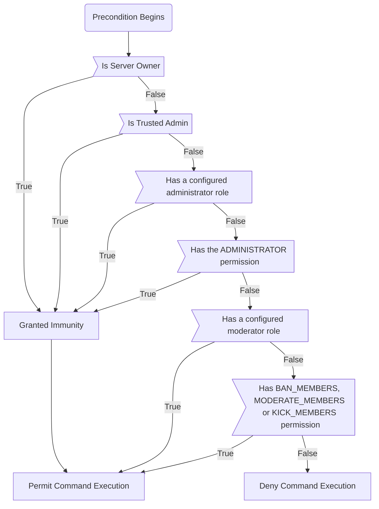

# Permissions V2

:::caution &nbsp;&nbsp;&nbsp;Unreleased Feature

This article is discussing a feature which _may_ come to sentry in the future.

The current permission system operates entirely using in-built discord permissions. You can modify access through `Settings > Integrations > Sentry > Commands`

:::

*You can view more details about this proposal over on our GitHub at #7*

Permissions V2 is a complete overhaul of our permissions system.

## Permissions Flow

Starting at the top, we immediately set 2 end states, where the command fails or succeeds. Along the way, if successful, the user may also obtain immunity from punishments themselves.

Server owners are unable to be punished by anyone for obvious reasons, and so we first check whether they are, and if so we grant immunity and let the command execute, short circuiting to prevent unnecessary checks.

If they aren't the server owner, we check if they are a trusted admin. Ill explain more about what "trusted" roles are [later](#what-are-trusted-roles), but similarly to the step above, if they are we grant immunity and short circuit.

They may also have the administrator role(s) or Discord's native `ADMINISTRATOR` permission (`1 << 3`). Then we also grant immunity and permit execution.

However, for moderators, we first check if they have the moderator role(s) or the corresponding permission (`BAN_MEMBERS`, `MODERATE_MEMBERS` or `KICK_MEMBERS`) which serves as our final decision point.

## What are "Trusted" Roles

:::danger

Trusted Admins recieve a high level of privilege, and have the capability of modifying **all** server settings.

> If you cannot walk over to your trusted admin and slap them in the face if they break your entire server's settings do not add them
> \- Josh, Sentry Developer

:::

Early on the permissions flow we designate a check for "trusted admins". This term is applied to admins who are a step above the rest.

Trusted admins are awarded this privilege individually, as opposed to being bulked in by a single role. Unlike regular admins, who do not recieve permissions to modify settings, trusted admins are treated as "extra owners" in a sense, being able to modify server settings using the (WIP) dashboard.

### Trusted Admins vs Admins vs Moderators vs Users

| Permission Level           | User                         | Moderator               | Admin                   | Trusted Admin |
|----------------------------|------------------------------|-------------------------|-------------------------|---------------|
| Can run commands           | Only non moderation commands | All moderation commands | All moderation commands | All commands  |
| Has immunity               | ❌                            | ❌                       | ✔️                       | ✔️             |
| Can modify server settings | ❌                            | ❌                       | ❌                       | ✔️             |

## Linking into Discord's Ecosystem

Under the hood, we can still use native `/` command permissions. However, to support additional roles (such as mod roles which don't have the permissions baked in), or to set commands that mod roles cannot use, we can use the owners/trusted admin's OAuth token to set the individual permissions of the role. 

This also provides discord integration so users can modify permissions without our dashboard, and reduces our data storage requirements.

## Migration

The migration to permissions V2 is primarily in the backend, as its fully backwards compatible. Permissions V2 is a major launch towards launching our dashboard however, and as a whole the entirety of our settings system.